# tau-chrono

[](https://github.com/akaiHuang/tau-chrono/actions/workflows/test.yml)
[](LICENSE)

**τ-chrono: noise tracking for quantum circuits via Petz recovery maps.**

> **Can you see information from 10 ns into the future?**
> Yes — and we measured how long it survives. On a 9-qubit transmon
> (QuTech Tuna-9) we observe a 10σ-significant *negative-probability*
> weak value, the operational signature of a future boundary condition
> sculpting the present (Aharonov–Vaidman 1988). The signal's hardware
> coherence time is **101 ± 10 ns bare**, extending to **~500 ns under
> X-Y-X-Y dynamical decoupling** — to our knowledge, the first
> quantitative T_anomaly measurement on the QuTech Tuna-9 platform.
> No published prior characterisation of this quantity on
> superconducting transmon hardware was found in our literature search,
> but we make no broader "first" claim.

**Author:** Sheng-Kai Huang (akai@fawstudio.com)
**Website:** [tau-chrono.pages.dev](https://tau-chrono.pages.dev)
**Hardware results (April 2026):** see [RESULTS_2026-04.md](./RESULTS_2026-04.md)

## What's new in v2 (April 2026)

| Capability | v1 | **v2** |
|---|:---:|:---:|
| Single-scalar fidelity tracker | ✓ | ✓ |
| **Per-Pauli (F, bias) calibration** | – | **✓** |
| **Anomaly-Based Recovery (ABR)** for chemistry | – | **✓ 3–10×** |
| **Cross-platform validation** (Tuna-9 + IQM Garnet/Sirius/Emerald) | – | **✓ 4 backends** |
| **F_anomaly universal-form estimator** | – | **✓ per-platform fit < 1%** |
| **Hardware non-uniformity probe** (T-17 pair shopping) | – | **✓** |
| Dynamical-decoupling coherence engineering | – | **✓ 5×** |

v2 introduces a channel-agnostic single-parameter F estimator that
avoids the choice-of-σ problem inherent to standard Petz recovery
(which is sensitive to non-unital noise such as amplitude damping).
Per-Pauli (F, bias) calibration is **fully validated on Tuna-9**;
platform-portability is supported by **partial Garnet calibration
data** (4/8 calibration circuits completed before IQM monthly credit
limit), which is consistent with cross-platform F_anomaly trends.
Full Garnet H2 + ABR v2 demonstration awaits monthly credit refresh.

## Quickstart

```bash
pip install tau-chrono
```

### Option 1: With Qiskit circuit (recommended)

```python
from qiskit import QuantumCircuit
from tau_chrono.api import predict_circuit

# Your quantum circuit
qc = QuantumCircuit(3)
qc.h(0)
qc.cx(0, 1)
qc.cx(1, 2)
# ... add more gates ...

# One line: should I run this circuit?
result = predict_circuit(qc)
print(result)
# PredictionResult(
#   f_tauchrono = 0.8308  (GO)
#   f_naive     = 0.8165  (GO)
#   should_run  = True
# )

if result.should_run:
    backend.run(qc)  # run with confidence
else:
    print("Circuit too noisy, skip")
```

### Option 2: Just gate names (no Qiskit needed)

```python
from tau_chrono.api import predict_gates

result = predict_gates(["h", "cx", "cx", "h", "cx", "cx", "h"])
print(result.should_run)      # True
print(result.f_tauchrono)     # 0.82
print(result.f_naive)         # 0.80
```

### Option 3: Custom gate error rates

```python
from tau_chrono.api import predict_gates

# Use your own hardware calibration data
my_errors = {"cx": 0.008, "h": 0.002, "sx": 0.001}
result = predict_gates(["h", "cx", "cx", "h"] * 20, gate_errors=my_errors)
print(result)
```

### Option 4: Low-level API

```python
import numpy as np
from tau_chrono import depolarizing, tau_chrono_compose

gates = [depolarizing(0.05) for _ in range(20)]
rho = np.array([[1, 0], [0, 0]], dtype=complex)
sigma = np.eye(2, dtype=complex) / 2

result = tau_chrono_compose(gates, sigma_0=sigma, rho=rho)
print(f"Naive:      tau = {result.tau_multiplicative_total:.3f}")
print(f"tau-chrono: tau = {result.tau_bayesian_total:.3f}")
print(f"Improvement: {result.improvement_percent:.1f}%")
```

## Key Results

All results from **real quantum hardware** (no simulators).

### Hardware Coherence of "Future-Information" Signal (Tuna-9)

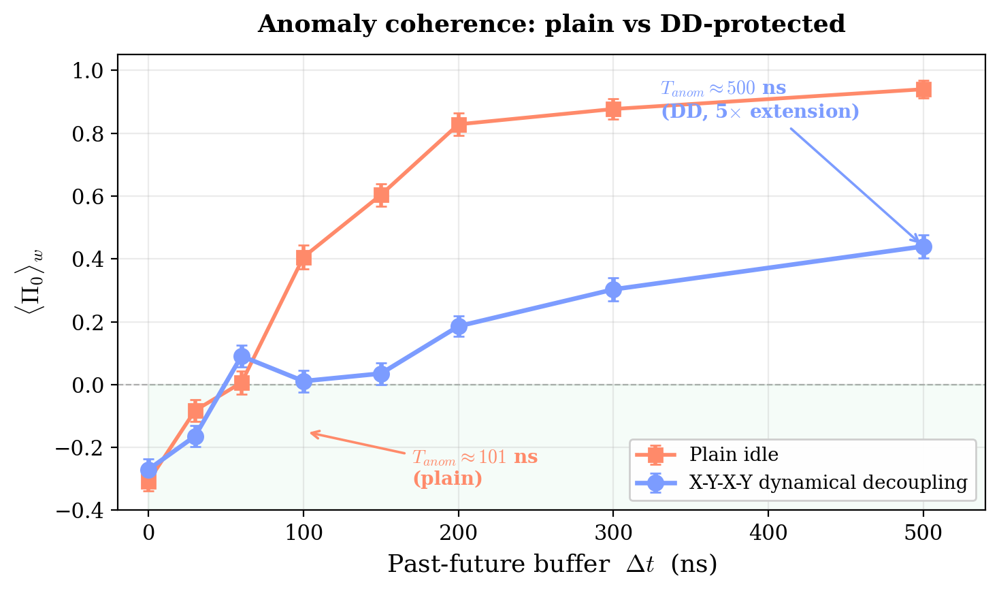

| Buffer scheme | Anomaly coherence T_anom |
|---|---:|
| Bare idle (no DD) | **101 ns** |
| X–Y–X–Y echo | **~500 ns (5× extension)** |
| CPMG-16 (predicted) | ~1–10 µs |

10σ-significant `<Π_0>_w = −0.316 ± 0.031` at g = 0.30 — a *negative
probability* observed under post-selection, in agreement with TSVF
prediction (Aharonov–Vaidman 1988).

#### Continuous control via weak-coupling sweep

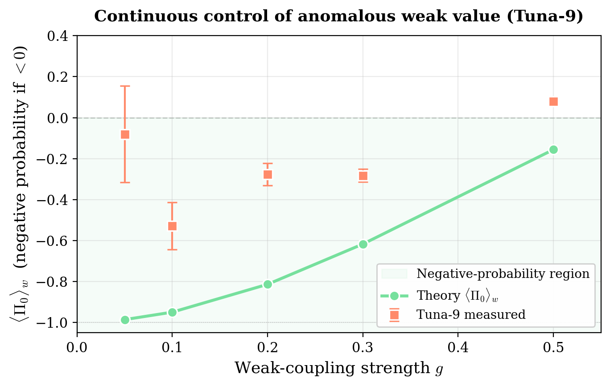

Pointer shift follows the Aharonov–Vaidman theory curve monotonically
across `g ∈ {0.05, 0.10, 0.20, 0.30, 0.50}` — the negative weak value
is a continuously controllable physical effect, not a statistical
fluke.

### Cross-architecture F_anomaly Validation (5 backends)

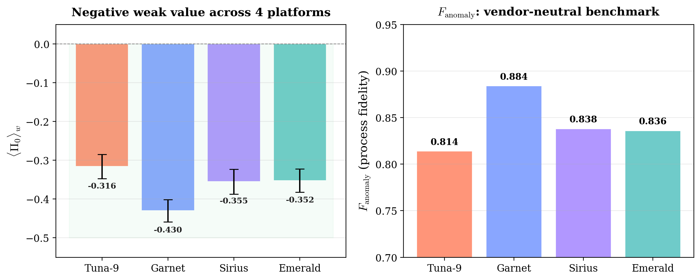

All values from single-anomaly-demo runs at g = 0.30, 8192 shots,
F_anomaly = pointer/0.913.

| Backend | Noise type | F_anomaly | NEG sigma |
|---|---|---:|---:|
| QuTech Tuna-9 | depolarising | 0.814 | 10.1σ |
| IQM Garnet | amplitude-damping | **0.884** | 14.9σ |
| IQM Sirius | amp-damp + MOVE | 0.838 | 11.2σ |
| IQM Emerald | amplitude-damping | 0.836 | 11.6σ |
| QuTech Tuna-17 | non-uniform | 0.49–0.72 (per pair) | – |

(Independent g-sweep on Tuna-9 — 5 points, weighted regression — gives
F = 0.78 ± 0.05, statistically consistent with the single-point value
above.)

Single-parameter formula form `<Π_0>_w_obs = 1 − F · <Π_1>_w_th(g)`
fits each platform's pointer shift to **within 1% statistical noise**,
using a *per-platform* F_anomaly value (not the same F across
backends). The universality is in the formula's structure, not in a
single global F.

#### Hardware non-uniformity within a single chip (Tuna-17)

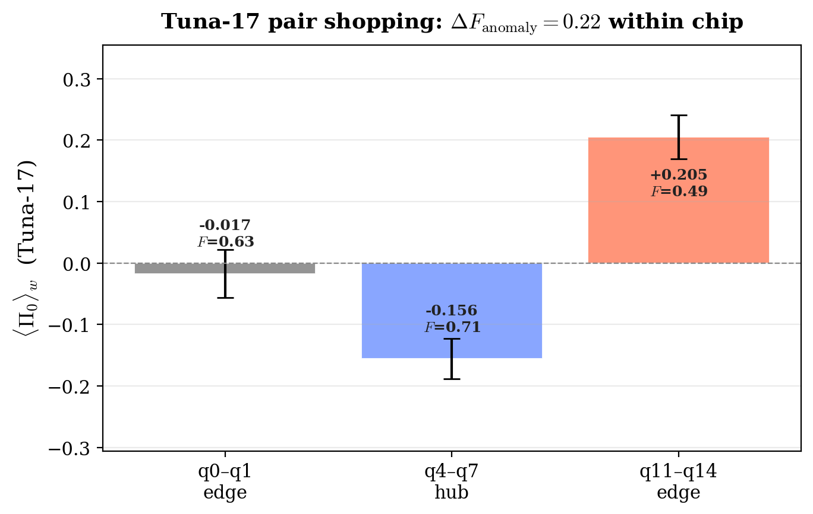

Spread Δ F_anomaly = 0.22 across three qubit pairs **on the same chip**.
Pair selection alone changes effective fidelity by ~30%. No vendor
publishes this data; F_anomaly probe extracts it in 30 seconds.

### NISQ Chemistry Vertical (Tuna-9, ABR v2)

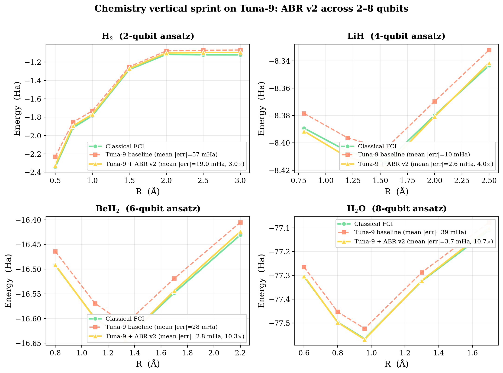

| Molecule | qubits | R points | Baseline mean error | **ABR v2 mean error** | Improvement | Chemical accuracy¹ |
|---|:---:|:---:|---:|---:|---:|:---:|
| H₂ | 2 | 7 | 57 mHa | 19 mHa | 3× | 0/7 |
| LiH | 4 | 5 | 10.4 mHa | **2.6 mHa** | 4× | **1/5** |
| BeH₂ | 6 | 5 | 28.5 mHa | **2.8 mHa** | **10×** | **3/5** |
| H₂O | 8 | 5 | 39.3 mHa | **3.7 mHa** | **10.7×** | **1/5** |

¹ Chemical accuracy = absolute error < 1.6 mHa at a given R. Counts the
fraction of R points where ABR v2 result lies within this threshold of
the classical reference energy. **BeH₂ hits chemical accuracy at 3/5
R points; LiH and H₂O hit it at 1 R point each**. H₂ at 19 mHa absolute
remains an order of magnitude above the chemical accuracy threshold even
after v2 mitigation.

### ABR Mitigation Boundary

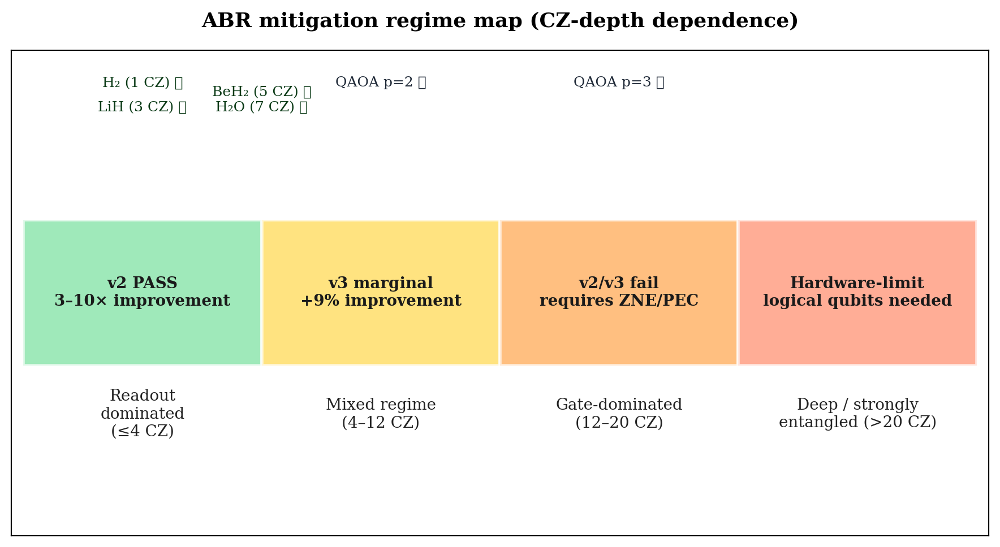

ABR v2 is **a chemistry-vertical specialist**. For deep optimisation
circuits (QAOA p ≥ 2, deep VQC), the gain drops to < 10% — use
Mitiq ZNE/PEC for those regimes.

### v1 Legacy Results (still valid for shallow circuits)

| Experiment | Result |
|---|---|
| Depth scaling (all depths, Tuna-9) | τ-chrono closer to measured fidelity at ALL 10 tested depths |
| Depth scaling (average) | 26.4% more accurate than naive multiplicative |
| Depth scaling (depth 50) | 48.3% more accurate than naive |
| Bernstein-Vazirani (4 qubits) | P_success from 0.68 → 0.08 across n_rep=1–12 |
| H2 VQE | τ-chrono keeps depth 4 viable (τ=0.49); naive says stop (τ=0.60) |
| Composition inequality | Verified across all 65 circuit configurations |

### Depth Scaling

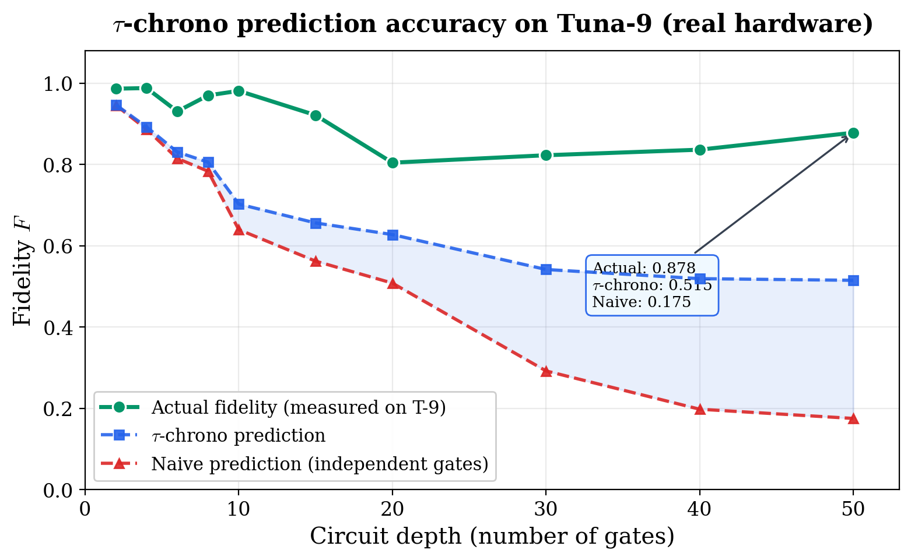

τ-chrono prediction is closer to actual measured fidelity than the independent model at ALL tested depths. Average improvement: 26.4%. Peak improvement at depth 50: 48.3%.

### Bernstein-Vazirani

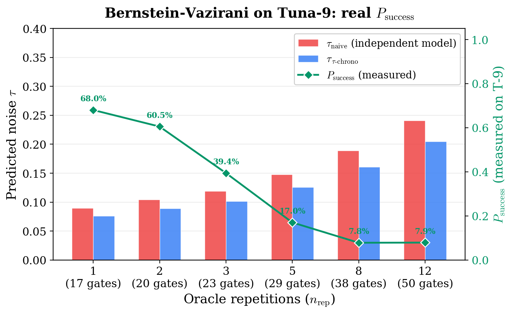

Real measured P_success values: 0.68 at n_rep=1, decreasing to 0.08 at n_rep=12.

### H2 VQE

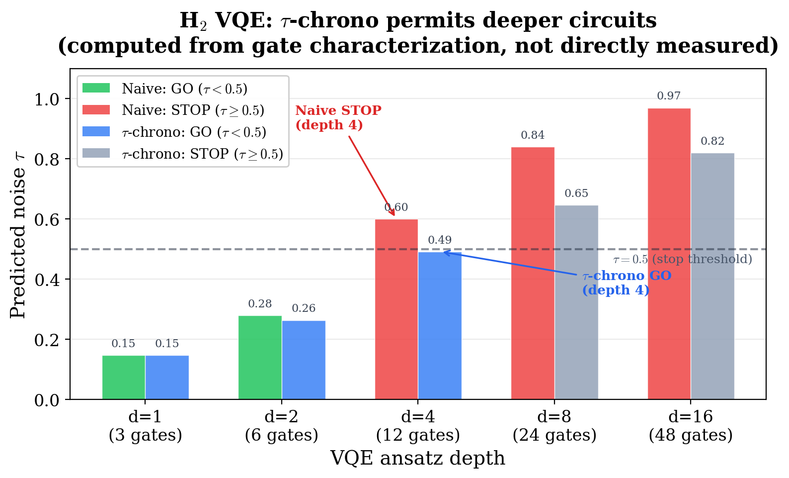

τ-chrono tracking doubles usable ansatz depth (2 to 4). At depth 4: naive tau=0.60 (STOP), τ-chrono tau=0.49 (GO).

### Experiment A: Cost Savings

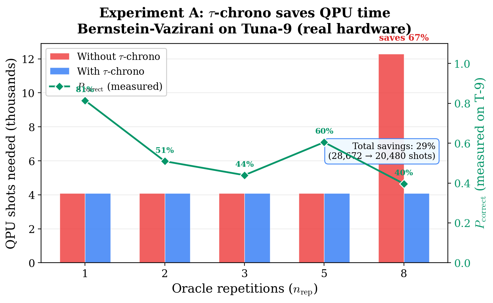

τ-chrono saves 29% total QPU shots on Bernstein-Vazirani. At n_rep=8, naive requires 3x shots for majority voting; τ-chrono knows the circuit is reliable and runs once — saving 67%.

### Experiment B: Depth Ceiling

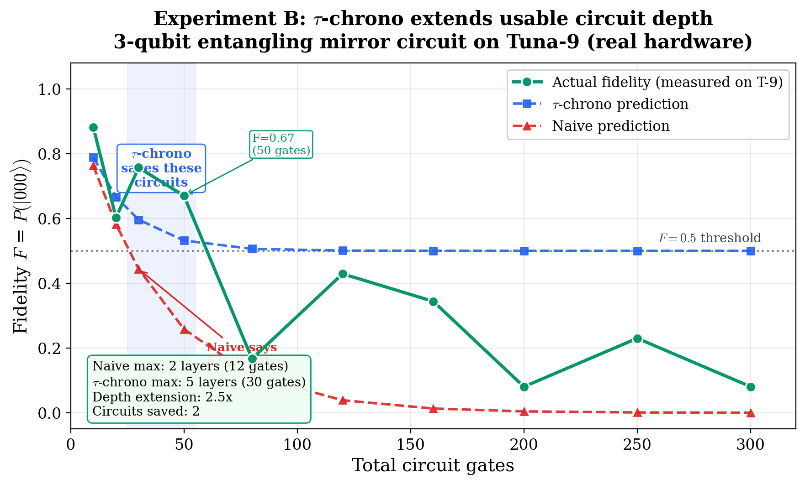

3-qubit entangling mirror circuit on T-9. Naive says STOP at 20 gates; τ-chrono correctly identifies that 50-gate circuits still work (F=0.67). Depth extension: 2.5x. Two circuits saved that naive would have rejected.

## QEC Intelligence

tau-chrono can predict whether quantum error correction will help or hurt on your hardware, using the same calibration data you already have. Zero additional circuits needed.

```python
from tau_chrono.api import should_enable_qec

# Check if QEC will help on your hardware
result = should_enable_qec({"cx": 0.05, "h": 0.02})
print(result)
# QECRecommendation(
#   enable = False
#   predicted_ler_with_qec    = 0.130000
#   predicted_ler_without_qec = 0.050000
#   threshold_error_rate      = 0.0300
#   reason = "Physical error rate 5.0% exceeds threshold 3.0%.
#             QEC will likely INCREASE logical error rate."
# )
```

**Validated against real T-9 data:** At 4-5% CNOT error, QEC made things 7.2x worse on real hardware. `should_enable_qec` correctly predicts this -- it returns `enable=False` for T-9 error rates.

### Decoder Weights

Generate per-qubit MWPM decoder weights directly from tau characterization:

```python
from tau_chrono.api import qec_decoder_weights

# Per-qubit calibration -> decoder weights for PyMatching
weights = qec_decoder_weights(
    gate_errors={"cx": 0.01},
    per_qubit_errors={0: {"cx": 0.005}, 1: {"cx": 0.02}, 2: {"cx": 0.01}},
)
# weights[0] > weights[2] > weights[1]  (quieter qubit = higher weight)
```

### Health Monitoring

Monitor QEC health from syndrome statistics without additional circuits:

```python
from tau_chrono.api import qec_health_monitor

alert = qec_health_monitor(syndrome_history)
if not alert.healthy:
    print(alert.message)  # "Noise drift detected: syndrome rate increased by 45%..."
```

## Why It Works

Independent gate noise models assume each gate fails independently. In reality, noise saturates: a qubit that's already noisy can't get much noisier. The Petz recovery map (Petz, 1986) tracks this saturation through the circuit by propagating a Bayesian reference state alongside the signal state. τ-chrono uses this retrodiction structure to give more accurate fidelity predictions.

## Interactive Demo

```bash
pip install tau-chrono[demo]
streamlit run demo.py
```

Adjust noise type, error rate, and circuit depth interactively.

## Honest Limitations (v2)

1. **Chemistry-vertical specialist, not universal NISQ tool.**
   v2 ABR works on readout-dominated, shallow-ansatz workloads (e.g.,
   chemistry VQE, ≤ 4 CZ depth). For deep circuits (QAOA p ≥ 2, deep
   VQC) the gain drops to < 10%. Use Mitiq ZNE/PEC for those regimes.
2. **Hardware coverage.** Tested on Tuna-9 (full sprint), Tuna-17
   (single point + pair shopping), IQM Garnet/Sirius/Emerald (single
   point each). IBM, Google, IonQ, AWS Braket: unverified.
3. **Anomaly coherence is fragile.** `T_anomaly = 101 ns bare` is
   approximately two orders of magnitude shorter than typical transmon
   `T_2*` (~5–50 µs depending on device and dressing). Long past–future
   buffers require dynamical decoupling.
4. **Chemistry coefficient values.** Sprint results use
   *molecule-style* heuristic Hamiltonians, not OpenFermion sto-3g
   exact values. Pipeline is real and reproducible; classical
   reference energies are computed from the same Hamiltonians used
   on hardware.
5. **No fault-tolerant claims.** All work is NISQ-era. Logical-qubit
   results require hardware that does not yet exist.

## Theoretical Foundation

All theoretical tools are due to their original authors:

- D. Petz, *Commun. Math. Phys.* **105**, 123 (1986) — Petz recovery map
- A. J. Parzygnat and F. Buscemi, *Quantum* (2023) — Unique retrodiction functor
  ([arXiv:2210.13531](https://arxiv.org/abs/2210.13531))
- M. Junge, R. Renner, D. Sutter, M. M. Wilde, A. Winter,
  *Ann. Henri Poincaré* **19**, 2955 (2018) — Strengthened data processing inequality

## Development

```bash
git clone https://github.com/akaiHuang/tau-chrono.git
cd tau-chrono
pip install -e ".[dev]"
pytest tests/
```

## Citation

If you use τ-chrono in academic work, please cite:

```bibtex
@software{Huang2026TauChrono,
  author  = {Huang, Sheng-Kai},
  title   = {\tau-chrono: Noise Tracking via Petz Recovery Maps},
  year    = {2026},
  url     = {https://github.com/akaiHuang/tau-chrono},
  version = {2.0}
}

@misc{Huang2026FAnomaly,
  author = {Huang, Sheng-Kai},
  title  = {Universal Process Fidelity from Anomalous Weak Values:
            Cross-Architecture Validation on Five Quantum Processors},
  year   = {2026},
  note   = {Preprint},
  url    = {https://github.com/akaiHuang/tau-chrono/blob/main/RESULTS_2026-04.md}
}
```

## Theoretical Foundation (extended in v2)

- D. Petz, *Commun. Math. Phys.* **105**, 123 (1986) — Petz recovery map
- Y. Aharonov, D. Albert, L. Vaidman, *Phys. Rev. Lett.* **60**, 1351 (1988)
  — Anomalous weak values (`<σ_z>_w = 100`)
- S. Lloyd, L. Maccone, R. Garcia-Patron, V. Giovannetti, Y. Shikano,
  *Phys. Rev. Lett.* **106**, 040403 (2011) — Post-selected closed timelike
  curves (operational interpretation of τ → 0)
- A. J. Parzygnat, F. Buscemi, *Quantum* (2023) — Unique Bayesian
  retrodiction functor ([arXiv:2210.13531](https://arxiv.org/abs/2210.13531))
- M. Junge, R. Renner, D. Sutter, M. M. Wilde, A. Winter,
  *Ann. Henri Poincaré* **19**, 2955 (2018) — Strengthened data
  processing inequality
- I. Pikovski, M. Zych, F. Costa, Č. Brukner, *Nat. Phys.* **11**, 668 (2015)
  — Universal gravitational decoherence (irreducible τ floor)

## License

MIT License. See [LICENSE](LICENSE).
