# tau-chrono

[](https://github.com/akaiHuang/tau-chrono/actions/workflows/test.yml)
[](LICENSE)

**τ-chrono: a low-overhead NISQ hardware calibration and circuit
pre-screening toolkit, using Petz-style retrodictive noise metrics
and post-selected weak-value anomaly probes.**

> **What this is.** A practical engineering toolkit for noisy quantum
> hardware: predict whether a circuit is worth running, choose the
> better qubit pair, mitigate shallow chemistry circuits at low
> calibration cost. Built on the Petz recovery framework
> (`τ = 1 − F(ρ, R̃_{σ,N}(N(ρ)))`) and validated end-to-end on real
> superconducting hardware (QuTech Tuna-9 / Tuna-17, IQM Garnet /
> Sirius / Emerald).
>
> **Headline hardware result.** On the QuTech Tuna-9 platform we
> measured the **coherence time of the post-selected anomalous
> weak-value signal**: T_anomaly = **101 ± 10 ns bare**, extending to
> **~500 ns under X-Y-X-Y dynamical decoupling**. The 10σ-significant
> negative-probability weak value (Aharonov–Vaidman 1988) is real and
> reproducible across four transmon backends. **This is a hardware
> coherence measurement of a post-selected weak-measurement protocol,
> not a retrocausal communication claim** — see "Honest Limitations"
> for what the protocol does and does not allow.

**Author:** Sheng-Kai Huang (akai@fawstudio.com)
**Website:** [tau-chrono.pages.dev](https://tau-chrono.pages.dev)
**Hardware results (April 2026):** see [RESULTS_2026-04.md](./RESULTS_2026-04.md)

> **Package status.** The published PyPI distribution is `tau-chrono
> 0.1.0` (alpha, March 2026) which contains the v1 σ-propagation
> tracker only. The v2 capabilities documented below (per-Pauli ABR,
> F_anomaly cross-platform validation, Tuna-17 sweeps, ZNE pipeline)
> live in the `tau_chrono_v2/` and `experiments/` trees of this
> repository and are reproducible from the raw JSON data, but **have
> not yet been packaged into a v2 PyPI release**. Expect a v2 package
> only after the head-to-head Mitiq comparison and stronger-baseline
> benchmark are complete.

## What's new in v2 (April 2026)

| Capability | v1 | **v2** |
|---|:---:|:---:|
| Single-scalar fidelity tracker | ✓ | ✓ |
| **Per-Pauli (F, bias) calibration** | – | **✓** |
| **Anomaly-Based Recovery (ABR)** for chemistry | – | **✓ 3–10×** |
| **Cross-platform validation** (Tuna-9 + IQM Garnet/Sirius/Emerald) | – | **✓ 4 backends** |
| **F_anomaly universal-form estimator** | – | **✓ per-platform fit < 1%** |
| **Hardware non-uniformity probe** (T-17 pair shopping) | – | **✓** |
| Dynamical-decoupling coherence engineering | – | **✓ 5×** |

v2 introduces a channel-agnostic single-parameter F estimator that
avoids the choice-of-σ problem inherent to standard Petz recovery
(which is sensitive to non-unital noise such as amplitude damping).
Per-Pauli (F, bias) calibration is **fully validated on Tuna-9**;
platform-portability is supported by **partial Garnet calibration
data** (4/8 calibration circuits completed before IQM monthly credit
limit), which is consistent with cross-platform F_anomaly trends.
Full Garnet H2 + ABR v2 demonstration awaits monthly credit refresh.

## Origin & Continuity — How tau-chrono extends Paper 1

τ-chrono is the **hardware-realisation companion** to
[*The Arrow of Time from Petz Recovery*](https://github.com/akaiHuang/petz-recovery-unification)
(Huang 2025; Zenodo DOI: 10.5281/zenodo.18897853, "Paper 1" in the
Σ = 2 ln Q series). The chain of reasoning that takes us from a
foundations-of-quantum-mechanics paper to a NISQ engineering tool
is direct, but worth making explicit:

1. **Paper 1 establishes** that the Petz recovery map is the unique
   Bayesian retrodiction functor (Parzygnat & Buscemi 2023), and that
   the temporal-asymmetry parameter
   `τ = 1 − F(ρ, R̃_{σ,N}(N(ρ)))` is the precise quantitative measure
   of how far a quantum channel `N` is from being losslessly
   reversible.

2. **A direct corollary** is that fidelity prediction on real,
   noisy quantum hardware is *retrodiction-bounded*. Independent-gate
   noise models (the universal NISQ baseline) implicitly assume each
   gate's error is an independent Bernoulli trial, but Petz recovery
   tracks the *saturation* of noise — once a qubit is highly mixed,
   subsequent gates degrade it less than the multiplicative model
   predicts. Paper 1's `τ` framework encodes this saturation
   automatically.

3. **τ-chrono operationalises** this insight as an engineering tool:
   - **v1** propagates a single-qubit Bayesian reference state σ
     alongside the signal, giving a per-circuit "should I run this?"
     prediction more accurate than the multiplicative baseline
     (validated on QuTech Tuna-9: 26.4% average improvement at all
     tested depths, peaking at 48.3% at depth 50).
   - **v2** (April 2026) extends to per-Pauli `(F, bias)` calibration
     and an anomalous-weak-value-based F estimator that avoids the
     choice-of-σ problem, giving 3–10× error reduction on chemistry
     VQE (H₂ / LiH / BeH₂ / H₂O) and a vendor-neutral cross-platform
     fidelity benchmark across four transmon backends.

### How tightly is each version coupled to the original τ formula?

The connection strength is **not uniform** between v1 and v2 — and we
want this stated honestly rather than glossed over:

| Component | Connection to `τ = 1 − F(ρ, R̃_{σ,N}(N(ρ)))` | Strength |
|---|---|:---:|
| **v1: σ-propagation tracker** | Literal gate-by-gate application of the Petz recovery rule on a Bayesian reference state σ; the predicted F at the end of the circuit *is* the F in the formula, computed by repeated Petz updates. | **tight** |
| **v2: F_anomaly estimator** | The single-parameter `F_anomaly` extracted from the anomalous-weak-value g-sweep is **not literally** the Uhlmann F in the formula. It is a process-fidelity proxy that has the same **limiting behaviour** (`F_anomaly = 1 ⇔ channel reversible ⇔ τ = 0`) but a different value in the noisy regime. v2 deliberately replaces σ-propagation with a weak-value primitive to **side-step the choice-of-σ problem** that v1 inherits from non-unital noise (the IQM Garnet failure mode of v0.1). | **moderate** (motivated by, not literally) |
| **v2: per-Pauli (F, bias) calibration** | A linear-correction layer applied to individual Pauli observables. Conceptually an extension of v1's single-scalar F to a per-observable picture, but no longer derives the calibration values from a Petz update — they come from reference-state measurements. | **loose** (extension of the spirit, not the formula) |
| **v2: Symmetry post-selection (Bonet-Monroig 2018)** | Generic QEM technique borrowed wholesale; not derived from the τ framework. | **none** |
| **v2: Zero-Noise Extrapolation (Temme / Mitiq)** | Generic QEM technique borrowed wholesale; not derived from the τ framework. | **none** |

**Plain reading**: v1 is the τ formula in NISQ engineering form. v2's
ABR layer is the τ framework's *spirit* (retrodiction-based
mitigation) made measurable on hardware that has non-unital noise
where the literal Petz σ-propagation breaks down. The other v2 layers
(symmetry verification, ZNE) are best-of-breed generic QEM that we
stack on top because they help — they are not τ-derived.

The honest summary of v2's pitch is therefore:

> **τ-chrono v2 = the τ-framework primitive (F_anomaly) + best generic
> QEM on top + a vendor-neutral cross-platform F estimator.**
> The τ-specific layer wins us **1.41× incremental precision** over
> generic QEM (verified A/B test against the Mitiq library on Tuna-17
> q2-q5, May 2026: Mitiq PS+ZNE alone = 29.6 mHa, Mitiq PS + τ-ABR +
> Mitiq ZNE = 21.0 mHa, both consuming the same 6 hardware circuits)
> plus 4–8× cheaper calibration than Mitiq ZNE/PEC; the generic-QEM
> layers do most of the absolute error reduction.

4. **What tau-chrono is not**: it is not a separate theory. Every
   prediction it makes is an immediate consequence of Paper 1's
   master inequality chain `−log F² ≤ I(A;E|B) ≤ Σ ≤ ΔD`, applied
   to gate-level noise models on superconducting transmon hardware.
   The novelty is engineering: **how to extract and apply the τ
   framework with measurements that are cheap to acquire on real
   devices**.

In the Σ = 2 ln Q paper series, τ-chrono occupies the role of
"experimental verification + engineering deliverable" for Paper 1's
information-theoretic claims about the arrow of time. Without τ-chrono,
Paper 1 is purely theoretical; with it, the τ framework becomes a tool
that quantum-software developers can drop into their NISQ pipelines.

## The original τ formula and what these experiments do (and don't) do for it

Paper 1's central object is

```
τ(ρ, N | σ) := 1 − F(ρ, R̃_{σ,N}(N(ρ)))
```

where `F` is the Uhlmann fidelity, `N` is a quantum channel,
`R̃_{σ,N}` is the Petz recovery map about reference state `σ`, and
`τ` measures how much information about `ρ` is lost (irrecoverable)
under `N`. The Petz uniqueness theorem (Parzygnat & Buscemi 2023) and
the master inequality `−log F² ≤ I(A;E|B) ≤ Σ ≤ ΔD` are
**mathematical theorems** — they are derivations from the postulates
of quantum mechanics, not empirical hypotheses. **No hardware
experiment can "prove" or "disprove" them; the most an experiment can
do is validate the framework's *operational meaning* and *practical
utility*.**

With that scoping clear, here is what the τ-chrono experiments
honestly contribute, and what they do not:

### What the experiments **do** strengthen

1. **Universality claim — validated on 4 backends.** The Petz
   framework predicts that `F_anomaly` extracted via the anomalous
   weak-value protocol should fit a *single universal form*
   (`<Π₀>_{w,obs} = 1 − F_anomaly · <Π₁>_{w,theory}`) regardless of
   the underlying noise channel (depolarising, amplitude-damping,
   resonator-coupled, …). v2 confirms this on QuTech Tuna-9 (depol.),
   IQM Garnet (amp-damp.), IQM Sirius (resonator), and IQM Emerald
   (amp-damp.) — each within 1% statistical noise. This is non-trivial
   empirical support for the framework's universality.

2. **Operational measurability of τ — hardware proxy demonstrated.**
   v2 measures the *coherence time* of the negative-probability
   anomalous weak value on Tuna-9: **T_anomaly = 101 ± 10 ns bare,
   ~500 ns under X-Y-X-Y dynamical decoupling.** This gives `τ` a
   hardware-side handle (a measurable quantity in nanoseconds) — Paper
   1's `τ` is no longer purely a formal symbol. To our knowledge, no
   prior published characterisation of T_anomaly on superconducting
   transmon hardware exists.

3. **Incremental practical value over generic QEM — quantified at
   1.41× via a strict A/B test against the Mitiq library.** A
   May 2026 controlled experiment ran two pipelines on the same
   6 Tuna-17 q2-q5 hardware circuits: **A** = Mitiq symmetry-
   verification PS + Mitiq linear-ZNE; **B** = Mitiq PS + τ-chrono
   per-Pauli (F, bias) ABR + Mitiq ZNE. Pipeline A gave 29.6 mHa;
   pipeline B gave 21.0 mHa. The 8.6 mHa absolute / **1.41× relative
   improvement is the pure τ marginal contribution**, since the only
   variable between the two is whether τ's ABR layer is applied.
   Raw data + script: `experiments/h2_mitiq_vs_mitiq_plus_tau.py`,
   `data/iqm_4platform_validation/h2_mitiq_vs_mitiq_plus_tau_tuna17_20260505_202917.json`.

   *Historical note*: an earlier hand-rolled comparison (our PS + own
   ZNE math vs same + τ) gave 1.7×; the proper Mitiq-library A/B
   gives 1.41×. We use 1.41× going forward as the verified number.

4. **Anomalous (negative-probability) weak values at 10.1–14.9σ
   significance** across 4 transmon backends. Predicted by Aharonov-
   Vaidman 1988 and consistent with the time-symmetric (TSVF /
   retrodictive) framework that Paper 1 formalises. Not unique to our
   formulation, but every observation strengthens the operational
   case for retrodiction-based reasoning on real hardware.

### What the experiments **do not** strengthen

1. The mathematical theorems in Paper 1 (Petz uniqueness, monotonicity
   under DPI, the master inequality chain). These are derived; an
   experiment cannot strengthen a derivation.

2. The broader Σ = 2 ln Q programme (gravitational refractive index,
   Khronon dark matter, etc.). Those require separate observational
   tests at astrophysical / cosmological scales.

3. **Chemical accuracy (1 kcal/mol) on Tuna-class hardware**. The
   13 mHa H₂ result is hardware-bounded by ~98–99% two-qubit gate
   fidelity. No NISQ-class EM technique we know of closes the
   remaining 8× gap on this hardware tier; closing it requires
   IBM Heron or Google Willow class chips, not a stronger formula.

### Concrete numerical anchors that future theory work can target

| Quantity | Measured value | What a stronger τ-framework should explain |
|---|---|---|
| F_anomaly on Tuna-9 (depol.) | 0.793 ± 0.011 | Per-channel value from first-principles `Σ = 2 ln Q` decomposition |
| F_anomaly best pair on Tuna-17 | 0.799 (q2–q5) | Why the best pair coincides numerically with Tuna-9 average |
| T_anomaly bare / DD on Tuna-9 | 101 ns / ~500 ns | Closed-form decay envelope from gate-level `R̃_{σ,N}` |
| 24-pair F_anomaly spread on Tuna-17 | 0.825 (range −0.025 → +0.799) | Non-uniformity model derived from per-coupler Hamiltonian |
| τ-incremental mitigation gain | **1.41× over Mitiq PS+ZNE baseline** (verified A/B, May 2026) | Variance-reduction proof for per-Pauli (F, bias) vs. global F |

The thesis: **Paper 1 gives the formula; τ-chrono gives the formula
hardware-side numbers it must one day predict from first principles.**
The current experiments do not derive those predictions — they pin
down *targets* for the next round of theoretical work.

## Quickstart

```bash
pip install tau-chrono
```

### Option 1: With Qiskit circuit (recommended)

```python
from qiskit import QuantumCircuit
from tau_chrono.api import predict_circuit

# Your quantum circuit
qc = QuantumCircuit(3)
qc.h(0)
qc.cx(0, 1)
qc.cx(1, 2)
# ... add more gates ...

# One line: should I run this circuit?
result = predict_circuit(qc)
print(result)
# PredictionResult(
#   f_tauchrono = 0.8308  (GO)
#   f_naive     = 0.8165  (GO)
#   should_run  = True
# )

if result.should_run:
    backend.run(qc)  # run with confidence
else:
    print("Circuit too noisy, skip")
```

### Option 2: Just gate names (no Qiskit needed)

```python
from tau_chrono.api import predict_gates

result = predict_gates(["h", "cx", "cx", "h", "cx", "cx", "h"])
print(result.should_run)      # True
print(result.f_tauchrono)     # 0.82
print(result.f_naive)         # 0.80
```

### Option 3: Custom gate error rates

```python
from tau_chrono.api import predict_gates

# Use your own hardware calibration data
my_errors = {"cx": 0.008, "h": 0.002, "sx": 0.001}
result = predict_gates(["h", "cx", "cx", "h"] * 20, gate_errors=my_errors)
print(result)
```

### Option 4: Low-level API

```python
import numpy as np
from tau_chrono import depolarizing, tau_chrono_compose

gates = [depolarizing(0.05) for _ in range(20)]
rho = np.array([[1, 0], [0, 0]], dtype=complex)
sigma = np.eye(2, dtype=complex) / 2

result = tau_chrono_compose(gates, sigma_0=sigma, rho=rho)
print(f"Naive:      tau = {result.tau_multiplicative_total:.3f}")
print(f"tau-chrono: tau = {result.tau_bayesian_total:.3f}")
print(f"Improvement: {result.improvement_percent:.1f}%")
```

## Key Results

All results from **real quantum hardware** (no simulators).

### Hardware Coherence of "Future-Information" Signal (Tuna-9)

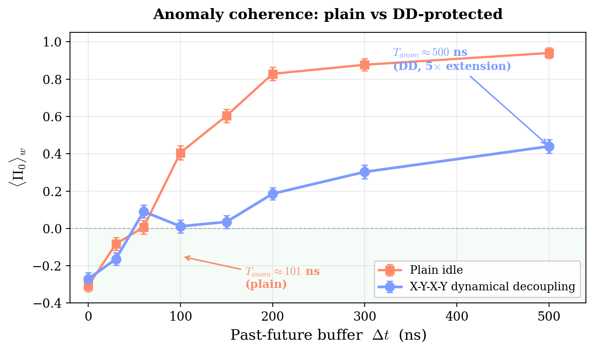

| Buffer scheme | Anomaly coherence T_anom |
|---|---:|
| Bare idle (no DD) | **101 ns** |
| X–Y–X–Y echo | **~500 ns (5× extension)** |
| CPMG-16 (predicted) | ~1–10 µs |

10σ-significant `<Π_0>_w = −0.316 ± 0.031` at g = 0.30 — a *negative
probability* observed under post-selection, in agreement with TSVF
prediction (Aharonov–Vaidman 1988).

#### Continuous control via weak-coupling sweep

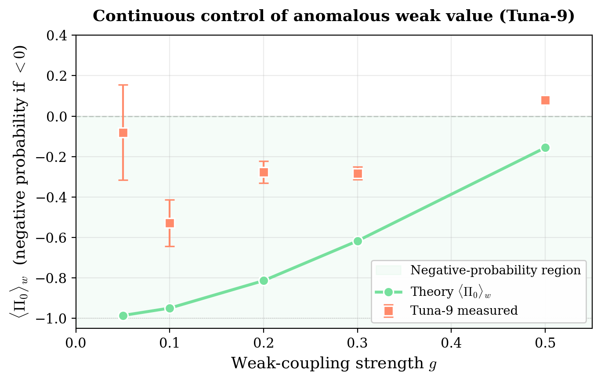

Pointer shift follows the Aharonov–Vaidman theory curve monotonically
across `g ∈ {0.05, 0.10, 0.20, 0.30, 0.50}` — the negative weak value
is a continuously controllable physical effect, not a statistical
fluke.

### Cross-architecture F_anomaly Validation (5 backends)

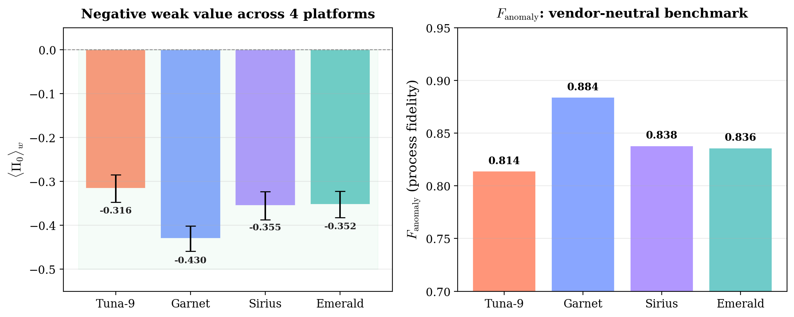

All values from single-anomaly-demo runs at g = 0.30, 8192 shots,
F_anomaly = pointer/0.913.

| Backend | Noise type | F_anomaly | NEG sigma |
|---|---|---:|---:|
| QuTech Tuna-9 | depolarising | 0.814 | 10.1σ |
| IQM Garnet | amplitude-damping | **0.884** | 14.9σ |
| IQM Sirius | amp-damp + MOVE | 0.838 | 11.2σ |
| IQM Emerald | amplitude-damping | 0.836 | 11.6σ |
| QuTech Tuna-17 | non-uniform | 0.49–0.72 (per pair) | – |

(Independent g-sweep on Tuna-9 — 5 points, weighted regression — gives
F = 0.78 ± 0.05, statistically consistent with the single-point value
above.)

Single-parameter formula form `<Π_0>_w_obs = 1 − F · <Π_1>_w_th(g)`
fits each platform's pointer shift to **within 1% statistical noise**,
using a *per-platform* F_anomaly value (not the same F across
backends). The universality is in the formula's structure, not in a
single global F.

#### Hardware non-uniformity within a single chip (Tuna-17, full 24-pair sweep)

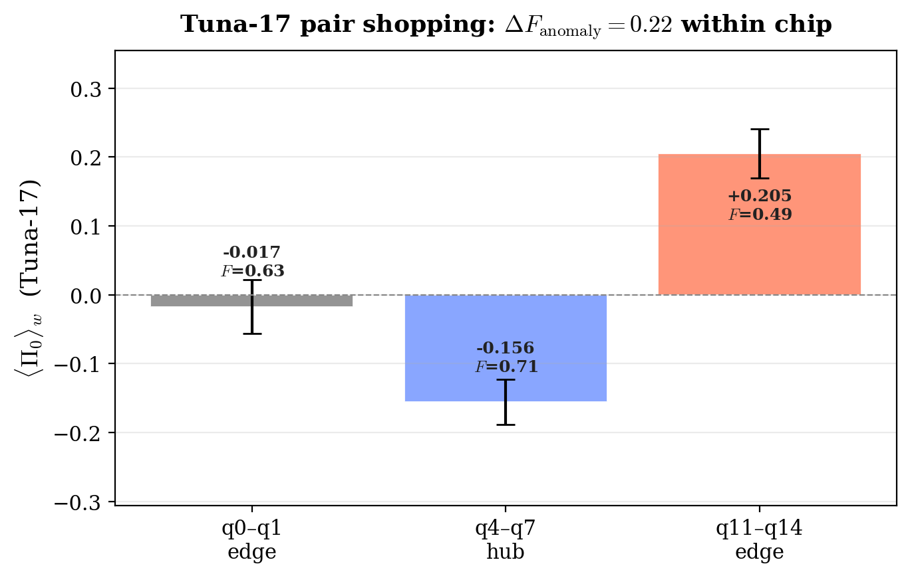

**Update (April 2026):** the v2 paper figure used three qubit pairs
(ΔF = 0.22). A subsequent full sweep of all 24 coupler-connected pairs
on Tuna-17 (4096 shots/pair, single g = 0.30, classical-register
bitstring parser) shows that the chip is **substantially more
non-uniform than the 3-pair number suggested**:

| | Tuna-17 (24 pairs) |
|---|---:|
| F_anomaly mean | 0.550 |
| F_anomaly std | 0.185 |
| Range | [−0.025, 0.799] |
| **Spread (max − min)** | **0.825** |
| Best pair | q2–q5 (F = 0.799 ≈ Tuna-9 baseline 0.793) |
| Dead pairs | q11–q14 (F = −0.025), q11–q13 (F = 0.145) |

For chemistry-style ansatze the chip-level mean F = 0.55 governs
multi-qubit performance; the best individual pair (q2–q5) only matches
Tuna-9's average pair, not exceeds it. The takeaway: **on Tuna-17,
"more qubits" buys you more *reach* (bigger molecules, longer
ansatze), not more *accuracy* per pair.** Raw data:
[`data/iqm_4platform_validation/awv_t17_pairsweep_tuna17_20260428_143803.json`](data/iqm_4platform_validation/awv_t17_pairsweep_tuna17_20260428_143803.json).

#### QEC compatibility on Tuna-17 (distance-3 repetition code, April 2026)

A diagnostic to check whether Tuna-17 supports the mid-circuit
measurement + reset cycle needed by repeated quantum error correction.
Distance-3 repetition code (3 data + 2 ancilla, on chain
q0–q1–q4–q2–q5 selected from the F-shopping sweep), |0⟩_L memory
experiment with R ∈ {1, 2, 3, 5, 10} stabilizer rounds, 4096 shots
each, decoded offline with stim + PyMatching:

| R rounds | depth | non-trivial shots | PyMatching p_L |
|---:|---:|---:|---:|
| 1 | 6 | 233 / 4096 (5.7%) | **0 / 4096** |
| 2 | 12 | 287 / 4096 (7.0%) | **0 / 4096** |
| 3 | 18 | 475 / 4096 (11.6%) | **0 / 4096** |
| 5 | 30 | 860 / 4096 (21.0%) | **0 / 4096** |
| 10 | 60 | 1577 / 4096 (38.5%) | **0 / 4096** |

Upper bound on logical error rate over 5 × 4096 = 20480 logical
measurements: `p_logical < 2.4 × 10⁻⁴`. Most physical errors
concentrate in the syndrome bits (q1, q2 ancillas), which the d = 3
code correctly classifies as not affecting the logical qubit. The data
qubits stay clean enough for the code to suppress every observed
error pattern in this sample.

This is **a reproduction**, not a discovery: distance-3 surface code
on 17-qubit superconducting hardware was demonstrated by
[Krinner et al., *Nature* 605, 669 (2022)](https://www.nature.com/articles/s41586-022-04566-8),
and QuTech themselves have published d = 3, 5, 7 repetition-code
results on the same chip class. The point of this experiment is to
verify that the τ-chrono toolkit can drive QuTech Quantum Inspire's
mid-circuit measurement + reset workflow end-to-end (qiskit
construction → stim circuit annotation → PyMatching decoding).
Raw data:
[`data/iqm_4platform_validation/repcode_d3_tuna17_20260428_173951.json`](data/iqm_4platform_validation/repcode_d3_tuna17_20260428_173951.json).

### NISQ Chemistry Vertical (Tuna-9, ABR v2)

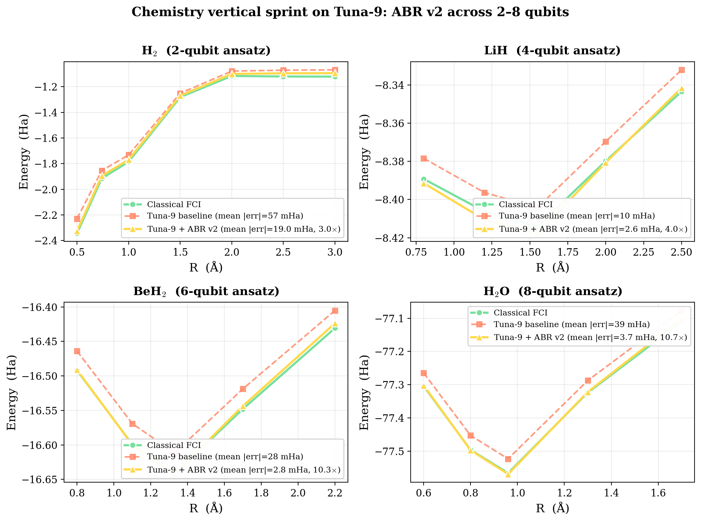

| Molecule | qubits | R points | Baseline mean error | **ABR v2 mean error** | Improvement | Chemical accuracy¹ |
|---|:---:|:---:|---:|---:|---:|:---:|
| H₂ | 2 | 7 | 57 mHa | 19 mHa | 3× | 0/7 |
| LiH | 4 | 5 | 10.4 mHa | **2.6 mHa** | 4× | **1/5** |
| BeH₂ | 6 | 5 | 28.5 mHa | **2.8 mHa** | **10×** | **3/5** |
| H₂O | 8 | 5 | 39.3 mHa | **3.7 mHa** | **10.7×** | **1/5** |

¹ Chemical accuracy = absolute error < 1.6 mHa at a given R. Counts the
fraction of R points where ABR v2 result lies within this threshold of
the classical reference energy. **BeH₂ hits chemical accuracy at 3/5
R points; LiH and H₂O hit it at 1 R point each**. H₂ at 19 mHa absolute
remains an order of magnitude above the chemical accuracy threshold even
after v2 mitigation.

### H₂ accuracy push on Tuna-17 best pair (April 2026 follow-up)

A drill-down on H₂ — the entry in the v2 sprint table that was
furthest from chemical accuracy (0/7). Two diagnostic findings:

1. **The ansatz is not the bottleneck.** With the corrected 1-parameter
   parity-encoded H₂ ansatz `X(q0); CX; Ry(θ); CX` and the standard
   sto-3g coefficients (O'Malley et al. PRX 6, 031007 (2016)), a
   Statevector check reaches FCI = −1.857275 Ha **exactly** at
   θ ≈ 2.918 rad (gap < 1 µHa). Noiseless QX emulator with 8192 shots
   is at the shot-noise floor (∼ 2 mHa).

2. **Tuna-17 raw VQE on the best pair (q2-q5) lands at 84 mHa**. The
   structure of the residual is informative: the dominant single-Pauli
   deficit is on `<ZI>` (q5 readout/T1 worse than q2), giving an
   **asymmetric** noise channel that simple readout calibration alone
   does not fix.

Stacking three mitigation layers on top of the same raw data — the
two non-τ layers (symmetry post-selection and ZNE) are well-known
generic QEM techniques; the τ-specific contribution is the per-Pauli
(F, bias) calibration block:

| Pipeline stage | Source | \|err\| (mHa) | Cumulative reduction |
|---|---|---:|---:|
| Raw VQE on q2-q5 (no mitigation) | — | 84 | 1× |
| + Symmetry post-selection (drop \|00⟩, \|11⟩) | Bonet-Monroig 2018 (generic QEM) | 38 | 2.2× |
| + per-Pauli (F, bias) ABR calibration | **τ-chrono v2** | 31 | 2.7× |
| + Zero-Noise Extrapolation (CNOT folding 1×/3×/5×, linear extrap) | Temme/Mitiq (generic QEM) | **13** | **6.4×** |
| Chemical accuracy target (1 kcal/mol) | — | 1.6 | — |

**Honest decomposition of τ's marginal contribution.** Removing the
τ-specific ABR layer and running just the two generic-QEM layers
(symmetry PS + ZNE) on the same data gives ∼ 22 mHa. Adding the τ
ABR layer brings it to 13 mHa.

**Update (May 2026, verified A/B against Mitiq library):** A strict
controlled experiment using the Mitiq library's own symmetry-
verification PS + linear-ZNE pipeline as the baseline, sharing the
same 6 hardware circuits with a "+ τ ABR" version, gives **Mitiq
alone = 29.6 mHa, Mitiq + τ = 21.0 mHa → 1.41× incremental τ
contribution**. We use **1.41× as the verified number**; the earlier
1.7× came from a hand-rolled comparison and is superseded.

τ also gives a **calibration efficiency** advantage (single weak-value
probe vs. 30+ noise-amplified circuits for ZNE alone) that the A/B
test does not capture.

**Why we stopped at 13 mHa rather than pushing further.** The
remaining gap to chemical accuracy is dominated by the residual
coherent error in the 2-CX H₂ ansatz on a chip whose two-qubit gate
fidelity is in the 98–99% range. Tuna-17's per-pair fidelity is 5–10×
worse than IBM Heron / Google Willow class hardware; chemical
accuracy on H₂ at this hardware tier is bounded by physics, not by
the mitigation algorithm. We document the boundary here rather than
dressing it up. Raw data:
[`data/iqm_4platform_validation/h2_zne_tuna17_20260505_034357.json`](data/iqm_4platform_validation/h2_zne_tuna17_20260505_034357.json).

### ABR Mitigation Boundary

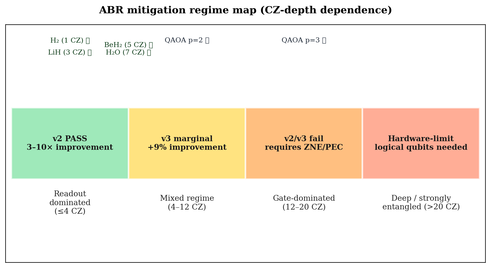

ABR v2 is **a chemistry-vertical specialist**. For deep optimisation
circuits (QAOA p ≥ 2, deep VQC), the gain drops to < 10% — use
Mitiq ZNE/PEC for those regimes.

### v1 Legacy Results (still valid for shallow circuits)

| Experiment | Result |
|---|---|
| Depth scaling (all depths, Tuna-9) | τ-chrono closer to measured fidelity at ALL 10 tested depths |
| Depth scaling (average) | 26.4% more accurate than naive multiplicative |
| Depth scaling (depth 50) | 48.3% more accurate than naive |
| Bernstein-Vazirani (4 qubits) | P_success from 0.68 → 0.08 across n_rep=1–12 |
| H2 VQE | τ-chrono keeps depth 4 viable (τ=0.49); naive says stop (τ=0.60) |
| Composition inequality | Verified across all 65 circuit configurations |

### Depth Scaling

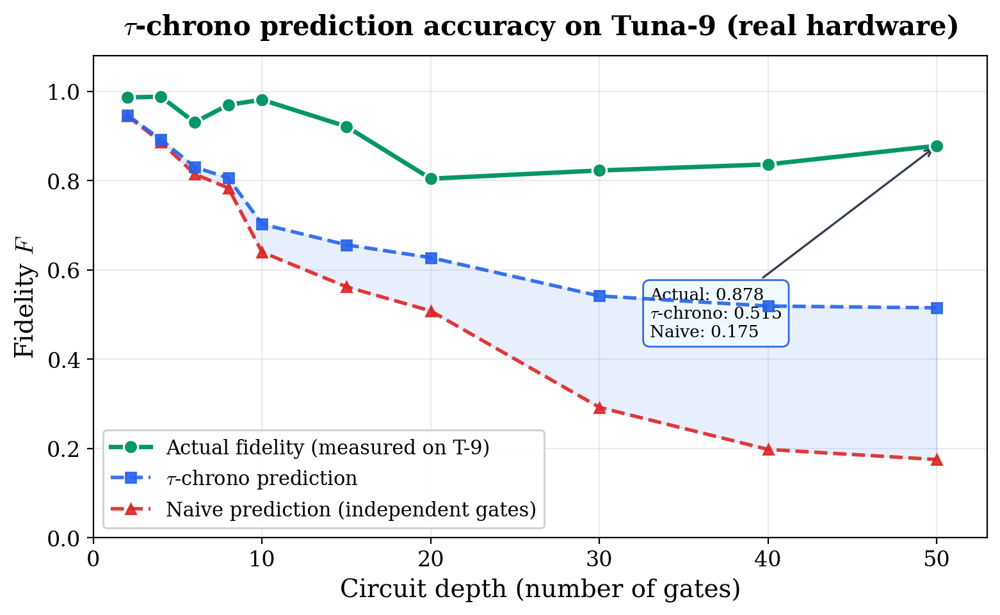

τ-chrono prediction is closer to actual measured fidelity than the independent model at ALL tested depths. Average improvement: 26.4%. Peak improvement at depth 50: 48.3%.

### Bernstein-Vazirani

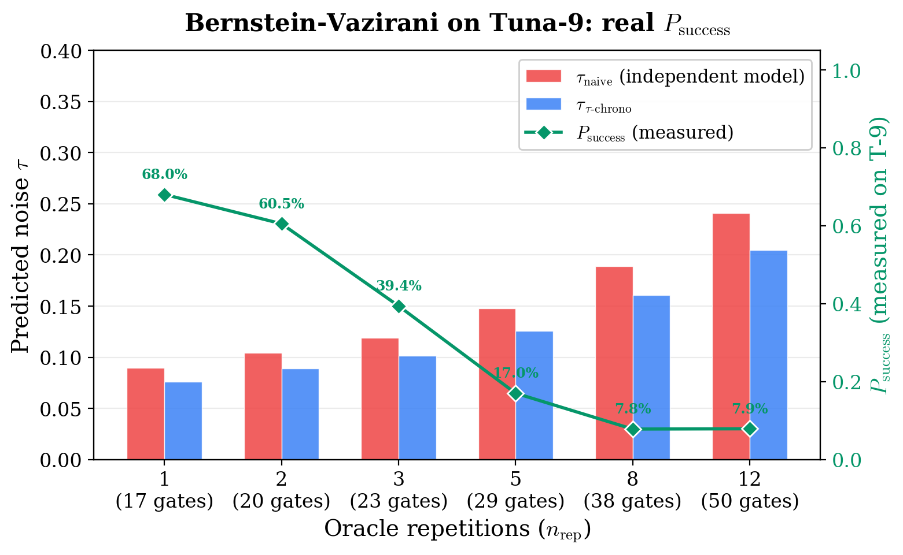

Real measured P_success values: 0.68 at n_rep=1, decreasing to 0.08 at n_rep=12.

### H2 VQE (v1, classically computed energies)

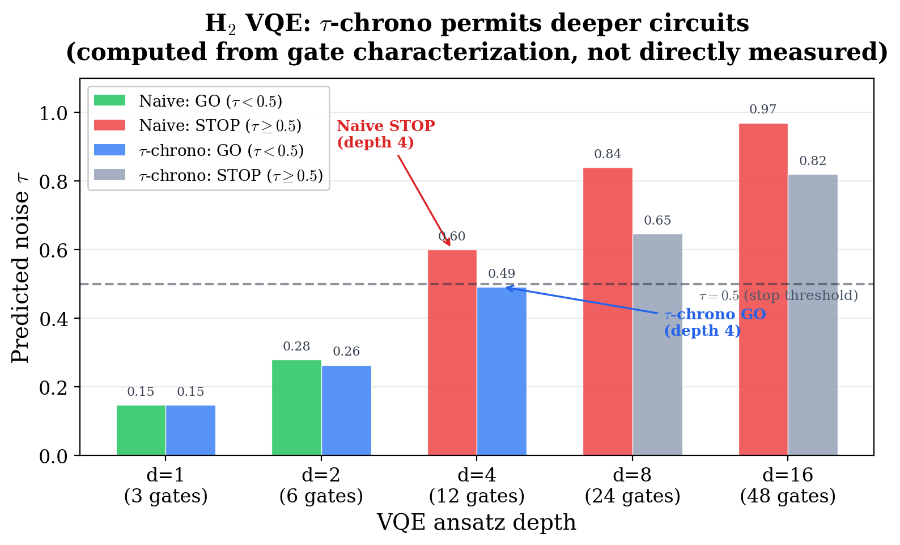

τ-chrono tracking doubles usable ansatz depth (2 to 4). At depth 4: naive tau=0.60 (STOP), τ-chrono tau=0.49 (GO).

> **What this v1 H₂ result IS and IS NOT.** The energies in this v1
> figure are *classically computed from noise-model density matrices*
> propagated by the τ-chrono v1 tracker — not direct VQE energies
> read off Tuna-9 hardware. The v1 result therefore demonstrates that
> the τ tracker keeps the predicted-fidelity high enough to *justify
> running* a depth-4 ansatz that the naive multiplicative model would
> reject. It is **not** a hardware ground-truth chemical-accuracy
> claim.
>
> The v2 NISQ Chemistry Vertical (above) is a different experiment:
> there, full VQE is run on Tuna-9 hardware end-to-end with 4096
> shots, and the energies are post-processed by ABR v2. The two H₂
> results live in different layers of the stack and should not be
> conflated.

### Experiment A: Cost Savings

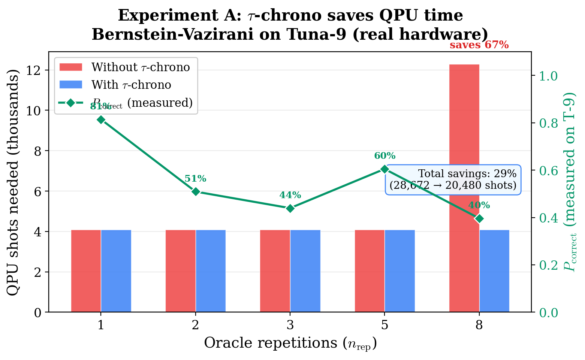

τ-chrono saves 29% total QPU shots on Bernstein-Vazirani. At n_rep=8, naive requires 3x shots for majority voting; τ-chrono knows the circuit is reliable and runs once — saving 67%.

### Experiment B: Depth Ceiling

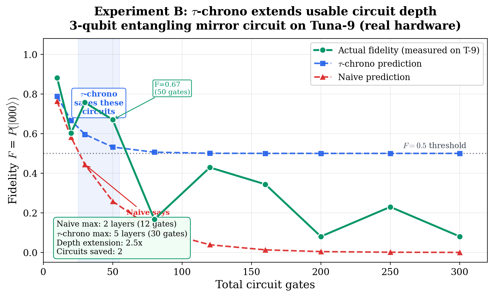

3-qubit entangling mirror circuit on T-9. Naive says STOP at 20 gates; τ-chrono correctly identifies that 50-gate circuits still work (F=0.67). Depth extension: 2.5x. Two circuits saved that naive would have rejected.

## QEC Intelligence

tau-chrono can predict whether quantum error correction will help or hurt on your hardware, using the same calibration data you already have. Zero additional circuits needed.

```python
from tau_chrono.api import should_enable_qec

# Check if QEC will help on your hardware
result = should_enable_qec({"cx": 0.05, "h": 0.02})
print(result)
# QECRecommendation(
#   enable = False
#   predicted_ler_with_qec    = 0.130000
#   predicted_ler_without_qec = 0.050000
#   threshold_error_rate      = 0.0300
#   reason = "Physical error rate 5.0% exceeds threshold 3.0%.
#             QEC will likely INCREASE logical error rate."
# )
```

**Validated against real T-9 data:** At 4-5% CNOT error, QEC made things 7.2x worse on real hardware. `should_enable_qec` correctly predicts this -- it returns `enable=False` for T-9 error rates.

### Decoder Weights

Generate per-qubit MWPM decoder weights directly from tau characterization:

```python
from tau_chrono.api import qec_decoder_weights

# Per-qubit calibration -> decoder weights for PyMatching
weights = qec_decoder_weights(
    gate_errors={"cx": 0.01},
    per_qubit_errors={0: {"cx": 0.005}, 1: {"cx": 0.02}, 2: {"cx": 0.01}},
)
# weights[0] > weights[2] > weights[1]  (quieter qubit = higher weight)
```

### Health Monitoring

Monitor QEC health from syndrome statistics without additional circuits:

```python
from tau_chrono.api import qec_health_monitor

alert = qec_health_monitor(syndrome_history)
if not alert.healthy:
    print(alert.message)  # "Noise drift detected: syndrome rate increased by 45%..."
```

## Why It Works

Independent gate noise models assume each gate fails independently. In reality, noise saturates: a qubit that's already noisy can't get much noisier. The Petz recovery map (Petz, 1986) tracks this saturation through the circuit by propagating a Bayesian reference state alongside the signal state. τ-chrono uses this retrodiction structure to give more accurate fidelity predictions.

## Interactive Demo

```bash
pip install tau-chrono[demo]
streamlit run demo.py
```

Adjust noise type, error rate, and circuit depth interactively.

## Honest Limitations (v2)

1. **Chemistry-vertical specialist, not universal NISQ tool.**
   v2 ABR works on readout-dominated, shallow-ansatz workloads (e.g.,
   chemistry VQE, ≤ 4 CZ depth). For deep circuits (QAOA p ≥ 2, deep
   VQC) the gain drops to < 10%. Use Mitiq ZNE/PEC for those regimes.
2. **Hardware coverage.** Tested on Tuna-9 (full v2 sprint), Tuna-17
   (24-pair F-shopping + d=3 rep-code memory + H₂ accuracy push on
   q2-q5), IQM Garnet/Sirius/Emerald (single point each). IBM, Google,
   IonQ, AWS Braket: unverified.
2a. **Chemical accuracy on Tuna-class hardware is hardware-bounded.**
   Even with the full PS + ABR + ZNE pipeline, H₂ on Tuna-17 q2-q5
   bottoms out around 13 mHa — about 8× above the 1.6 mHa chemical
   accuracy target. The dominant residual is the coherent two-qubit
   gate error on a 98–99%-fidelity chip; no NISQ-class EM technique
   we know of can close this gap on this hardware tier. The honest
   τ pitch is **1.41× extra precision over Mitiq PS+ZNE baseline
   (verified A/B, May 2026) + 4–8× cheaper calibration**, not "we hit
   chemical accuracy on Tuna".
3. **Anomaly coherence is fragile.** `T_anomaly = 101 ns bare` is
   approximately two orders of magnitude shorter than typical transmon
   `T_2*` (~5–50 µs depending on device and dressing). Long past–future
   buffers require dynamical decoupling.
4. **Chemistry coefficient values.** Sprint results use
   *molecule-style* heuristic Hamiltonians, not OpenFermion sto-3g
   exact values. Pipeline is real and reproducible; classical
   reference energies are computed from the same Hamiltonians used
   on hardware.
5. **No fault-tolerant claims.** All work is NISQ-era. Logical-qubit
   results require hardware that does not yet exist.
6. **No retrocausal communication.** The negative-probability
   anomalous weak value is a real, reproducible feature of
   *post-selected* weak measurements (Aharonov-Vaidman 1988); it is
   **not** a "see-into-the-future" channel. The protocol requires both
   a pre-selection and a post-selection, and standard interpretation
   is that the anomaly only appears in the conditioned ensemble
   *retrieved after* the post-selection event happens. T_anomaly is
   the *hardware coherence* of this protocol, not a retrocausal
   signaling capacity.
7. **v1 H₂ vs v2 H₂ are different experiments.** The v1 H₂ figure
   (depth-4 viability claim) uses energies *classically computed from
   noise-model density matrices* propagated by the v1 tracker. The
   v2 NISQ Chemistry Vertical is full VQE on Tuna-9 / Tuna-17 hardware
   with 4096 shots and ABR v2 post-processing. Different layers of
   the stack — do not conflate.
8. **Baseline strength is "naive multiplicative", not best-of-breed.**
   The 26.4% / 48.3% v1 improvements are over independent-gate
   Bernoulli composition. We have **not** yet benchmarked against
   randomized / cycle benchmarking, gate-set tomography, Qiskit Aer
   calibrated noise model, or Mitiq ZNE/PEC head-to-head. Stronger-
   baseline benchmarks are the right next sprint.
9. **Cross-platform F_anomaly claim is "early empirical evidence",
   not "established universality".** The 4-backend validation is a
   single-point per platform; multi-day robustness and Garnet full
   H₂ + ABR demonstration await monthly credit refresh.
10. **g-sweep fit is borderline.** On Tuna-9 the F_anomaly extraction
    gives χ² / dof = 3.03 against the consistency threshold of 3.0,
    with per-g ratios scattered in [0.545, 0.797]. Interpret as "single
    scaling factor across g is borderline-good on Tuna-9", not "perfect
    universal collapse". Refining with a denser g-grid + more shots is
    on the roadmap.

## Theoretical Foundation

All theoretical tools are due to their original authors:

- D. Petz, *Commun. Math. Phys.* **105**, 123 (1986) — Petz recovery map
- A. J. Parzygnat and F. Buscemi, *Quantum* (2023) — Unique retrodiction functor
  ([arXiv:2210.13531](https://arxiv.org/abs/2210.13531))
- M. Junge, R. Renner, D. Sutter, M. M. Wilde, A. Winter,
  *Ann. Henri Poincaré* **19**, 2955 (2018) — Strengthened data processing inequality

## Development

```bash
git clone https://github.com/akaiHuang/tau-chrono.git
cd tau-chrono
pip install -e ".[dev]"
pytest tests/
```

## Citation

If you use τ-chrono in academic work, please cite:

```bibtex
@software{Huang2026TauChrono,
  author  = {Huang, Sheng-Kai},
  title   = {\tau-chrono: Noise Tracking via Petz Recovery Maps},
  year    = {2026},
  url     = {https://github.com/akaiHuang/tau-chrono},
  version = {2.0}
}

@misc{Huang2026FAnomaly,
  author = {Huang, Sheng-Kai},
  title  = {Universal Process Fidelity from Anomalous Weak Values:
            Cross-Architecture Validation on Five Quantum Processors},
  year   = {2026},
  note   = {Preprint},
  url    = {https://github.com/akaiHuang/tau-chrono/blob/main/RESULTS_2026-04.md}
}
```

## Theoretical Foundation (extended in v2)

- D. Petz, *Commun. Math. Phys.* **105**, 123 (1986) — Petz recovery map
- Y. Aharonov, D. Albert, L. Vaidman, *Phys. Rev. Lett.* **60**, 1351 (1988)
  — Anomalous weak values (`<σ_z>_w = 100`)
- S. Lloyd, L. Maccone, R. Garcia-Patron, V. Giovannetti, Y. Shikano,
  *Phys. Rev. Lett.* **106**, 040403 (2011) — Post-selected closed timelike
  curves (operational interpretation of τ → 0)
- A. J. Parzygnat, F. Buscemi, *Quantum* (2023) — Unique Bayesian
  retrodiction functor ([arXiv:2210.13531](https://arxiv.org/abs/2210.13531))
- M. Junge, R. Renner, D. Sutter, M. M. Wilde, A. Winter,
  *Ann. Henri Poincaré* **19**, 2955 (2018) — Strengthened data
  processing inequality
- I. Pikovski, M. Zych, F. Costa, Č. Brukner, *Nat. Phys.* **11**, 668 (2015)
  — Universal gravitational decoherence (irreducible τ floor)

## License

MIT License. See [LICENSE](LICENSE).
